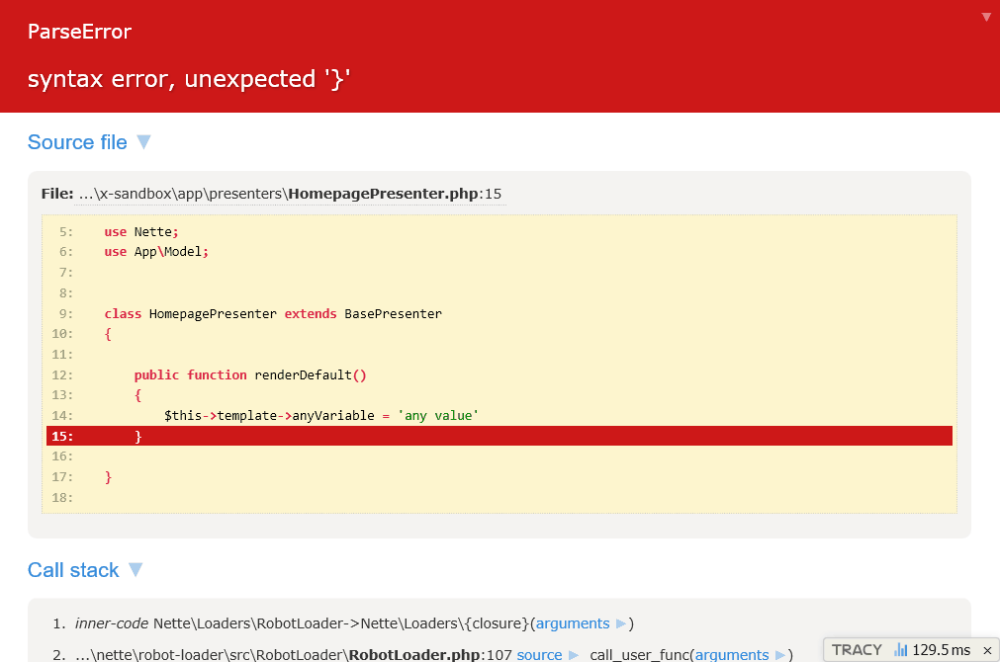

# Tracy plugin for Craft CMS 4

Plugin integrates awesome [nette/tracy](https://github.com/nette/tracy) debugging tool into [Craft CMS](https://craftcms.com/). See Tracy in action [here](https://nette.github.io/tracy/tracy-exception.html).



## Requirements

* PHP 8.0.2+
* Craft CMS 4.0+

## Installation

To install the plugin, follow these instructions.

1. Open your terminal and go to your Craft project:

        cd /path/to/project

2. Then tell Composer to load the plugin:

        composer require siteone/craft-tracy

3. In the Control Panel, go to Settings → Plugins and click the “Install” button for Tracy.

## Usage

In addition to the standard `dump($var)`, `dumpe($var)`, `bdump($var)` functions in PHP, the plugin provides the following functions in templates:

```twig
{{ dump(entity) }} or {{ d(entity) }} - Dump variable in place.

{{ dumpe(entity) }} or {{ dd(entity) }} - Dump variable in place and exit.

{{ bdump(entity) }} or {{ bd(entity) }} - Dump variable to debug bar.
```

## Settings

Some settings can be changed. Just create a `config/tracy.php` file, insert the following code (defaults) and change the values as needed:

```php
<?php

return [
	// Maximum string length
	'maxLength' => 150,
	// How deep will list
	'maxDepth' => 4,
	// Hide values of these keys
	'keysToHide' => [],
	// Visual theme (light, dark)
	'dumpTheme' => 'light',
	// Display the location where dump() was called?
	'showLocation' => false,
];

```

## Official resources

Official Tracy resources can be found here:
* [Website](https://tracy.nette.org/en/)
* [Documentation](https://tracy.nette.org/en/guide)
* [Repository](https://github.com/nette/tracy)
